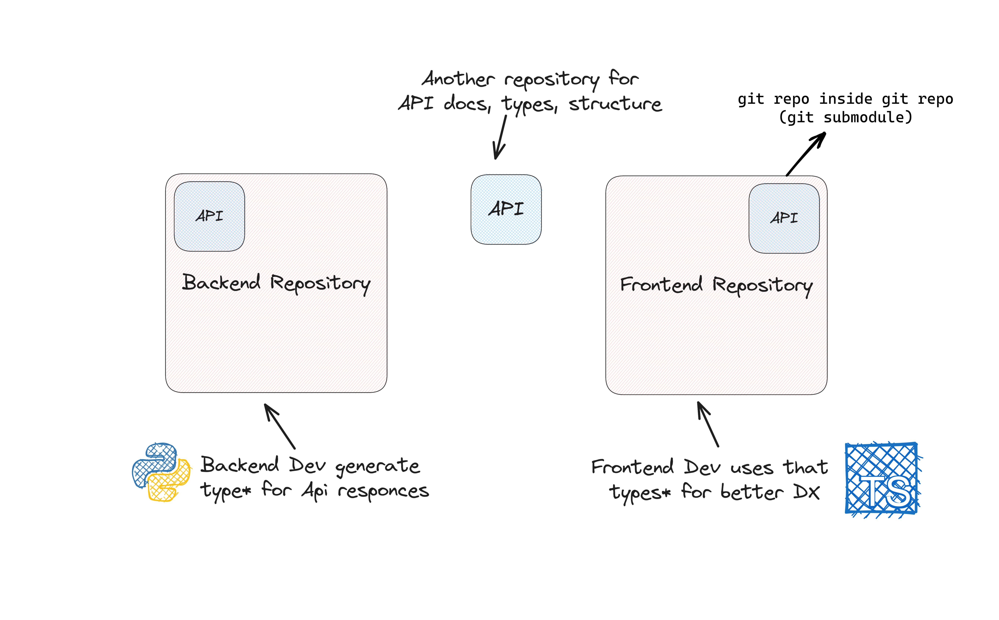

## Interphase - Bridging Backend and Frontend Development with Git Submodule



`Interphase` is a powerful `tool` + `git structure` designed to streamline the collaboration between backend and frontend developers by facilitating the sharing of critical information, including types, example data, API URLs, and documentation. The core concept is to provide an interconnected platform that enables seamless communication between these two development environments, thereby reducing friction and enhancing productivity, thus bridging the gap between the two development repository.

---

### Currently Available Support Packages
- [Interphase](https://pypi.org/project/Interphase/) - Python → Typescript
- [Coming Soon]() - Go → Typescript

### Requirements
> `Python >= 3.7`

### 1. Installation


```bash
$ pip install interphase
```

### 2. Quick Start


#### 📁  Simple folder structure
```
📁  your_project
|
├──📁 types (requied)
|   |
│   └──📄user.d.ts (optional)
|
└──📄main.py
```


#### 📄main.py
```python
from interphase import typewriter

ts = typewriter("./types")

userData = {
    "name": "John Doe",
    "age": 30,
    "email": "example@demo.com",
    "skills": ["Python", "TypeScript", "JavaScript"]
}

ts.write('user', 'UserData', userData)
```

#### 📄 user.d.ts
```typescript
export type UserData = {
    name: string;
    age: number;
    email: string;
    skills: string[];
}
```


### 3. Real Life Developer Usage


#### .gitmodules

```toml
[submodule "api"]
	path = api
	url = https://github.com/username/api.git
```

#### Frontend

```
📁 FrontEnd-repo
│
├──📁 api (git submodule)
│   │
│   ├──📄__init__.py
│   ├──📄setup.py
│   │
│   └──📁 types
│       │
│       └──📄 user.d.ts
│
├──📁 src
│   │
│   └──📄 (other frontend files, where /api/types are imported and used)
│   
├──📄 package.json
├──📄 .gitmodules (important)
└──📄 .gitignore
```

#### Backend

```
📁 Backend-repo
│
├──📁 api (git submodule)
│   │
│   ├──📄__init__.py
│   ├──📄setup.py
│   │
│   └──📁 types
│       │
│       └──📄 user.d.ts
│
├──📁 src
│   │
│   └──📄 (other backend files, where helps to create types for /api)
│   
├──📄 requirements.txt
├──📄 .gitmodules (important)
└──📄 .gitignore
```

### 4. Configuration

##### 📄 /api/setup.py 

```python
config = typewriter("./api/types", d_ts=True) # base setup
```
##### 📄 /api/\_\_init\_\_.py

```python
from .setup import config as ts
```

### 5. API Reference

##### export types | interface
```python
ts = typewriter("./api/types") 

# default is export enabled
ts.write('user', 'UserData', userData)
ts.write('user', 'UserData2', userData, export=False)

# default is type and interface can be enabled
ts.write('user', 'UserData3', userData, interface=True)
ts.write('user', 'UserData3', userData, export=False, interface=True)
```
```typescript
// user.d.ts

export type UserData = {...}
type UserData2 = {...}

export interface UserData3 {...}
interface UserData3 {...}
```

##### base folder
```python
# base directory can't be empty string
ts = typewriter("api/types") 
ts = typewriter("./api/types") 


# d.ts is defualt
# .ts can be enabled
ts = typewriter("./api/types", d_ts=False) 
ts.write('user', 'UserData', userData)
```
```typescript
export type UserData = {...} // user.ts 
```


##### file name
```python
# type name and file name can't be empty string
ts.write('user.ts', 'UserData', userData)
ts.write('user.d.ts', 'UserData', userData)


# d.ts is defualt
ts.write('user', 'UserData', userData)
```

### 6. Contributing Guide

We encourage contributions from the community to make Interphase even more powerful and versatile. If you find issues, have ideas for improvements, or want to suggest new features, please check our Contribution Guidelines for more information.

```bash
$ git clone https://github.com/rajatsandeepsen/interphase.git
$ cd interphase
```

```bash
$ pip install --upgrade setuptools
$ pip install --upgrade build
$ pip install --upgrade twine
```

```bash
$ python -m build # takes a lot of time
```
```
build result will be like:

📁 interphase
├──📁 interphase
├──📄pyproject.toml
├──📄requirements.txt
├──📄.gitignore
├──📄setup.py
│
└──📁 dist
    │
    ├──📄interphase-0.0.6.whl
    └──📄interphase-0.0.6.tar.gz
```

```bash
# install from dist

$ pip install dist/interphase-0.0.6.whl
# or
$ pip install dist/interphase-0.0.6.tar.gz
```

```bash
# upload to pypi
$ python -m twine upload --repository pypi dist/*
# enter username & password from pypi
```

### 7. License

Interphase is not released under any License.

---

Feel free to customize and expand upon this draft to best reflect the features, benefits, and usage of your "Interphase" package.
